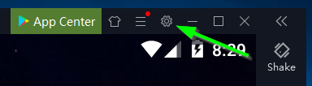
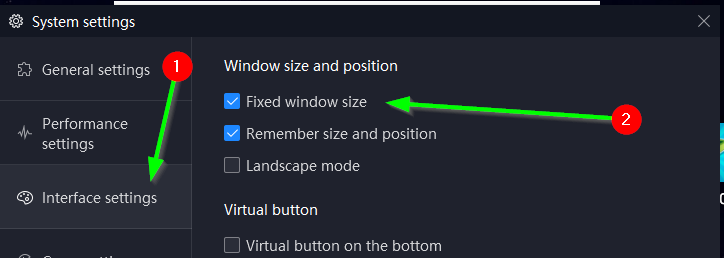
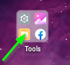
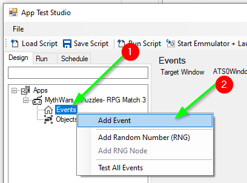
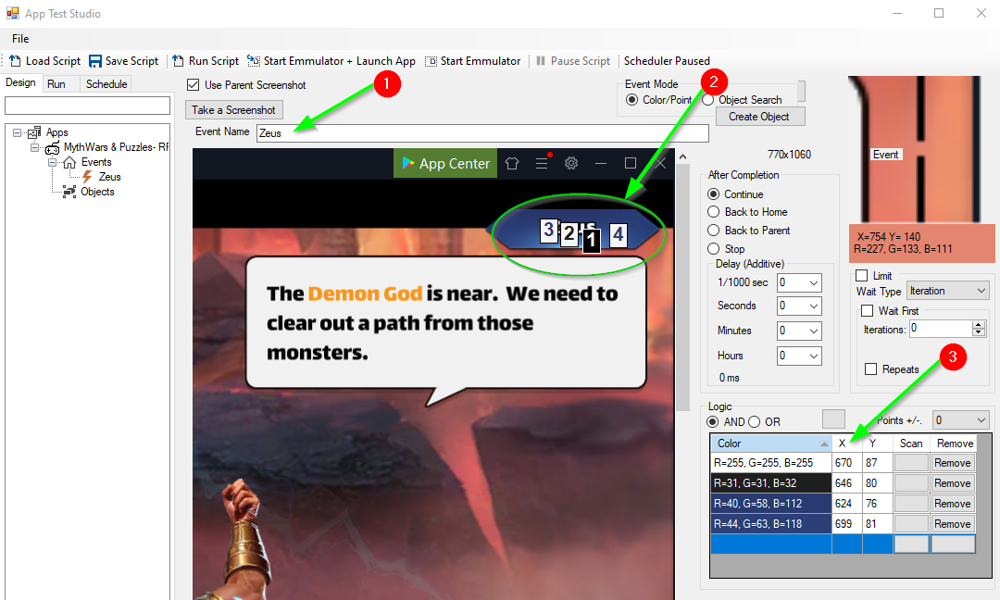
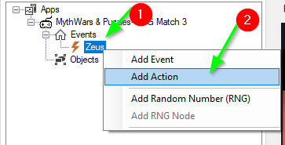
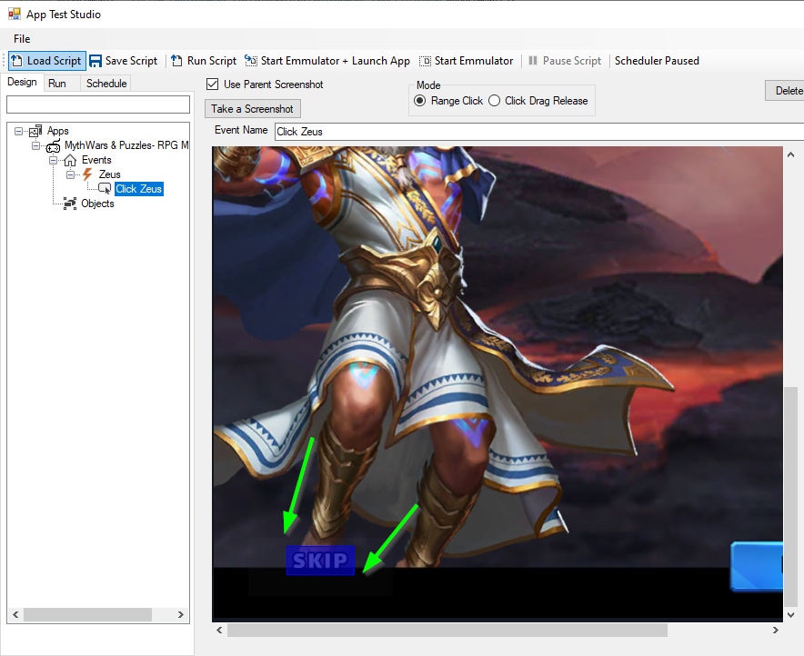

# AppTestStudio

AppTestStudio is a automated development environment, it contains a builder, tester, and can simultaneously run multiple scripts that can automate multiple android apps.  

Interactively: Design, Test, Schedule and Play multiple clients at the same time.

## Getting Started
1. Install [NoxPlayer](https://www.bignox.com/) 

   1.1 - Launch NoxPlayer client go to Gear on the top menu(Settings)->Interface Settings-> Make sure fixed Window size is checked.
   
   
   

2. Install the app of your choice on the Nox player.

   
   

3. Install AppTestStudio

## To Create a new project in AppTestStudio use the Wizard.

### 1.) In AppTestStudio go to File->New->Wizard

### 2.) Use the wizard to quickly configure a project in seconds.
1.) Enter Seach text for app or game.

2.) Click on the Search button to search for the app.

3.) Click on the app.

4.) Game ID and Name will autopopulate.

5.) Click Create Project

### 3.) Start the emmulator

***Always launch the Emmulator from AppTestStudio***  AppTestStudio launches the emmulator with a specific  WindowName, and resolution for consistency and automation.

1.) The Package Name is used to launch the application when the emmulator starts.  If the Package Name is configured, pressing the "Start Emmulator + Launch App" button will launch the instance of nox player specified in the instance to launch (in 2. below).  Package Name is recommended but not required, if you don't want or have the Package Name, Press the "Start Emmulator"( in 4. below) button instead.  Then run the application from the emmulator manually.  When scheduling a script to run at a later time, the application the Package name is required so that the script can be run, and the applicaion can be loaded.

2.) Instance to launch is the instance number you want to target during testing, launching and running scripts.  This is required, users with a single instance will always choose instance 0.  Multiple apps/accounts can be configured on different instances.  For example, you could run 5 instances with the same account, and automate 5 different apps/games on each instance.  Or you could run a differnet account on each instance, and run 5 separate instances of the same app/game.

3.)  The Start Emmulator + Launch App button will run the Android Emmulator and launch the application on the emmulator.

4.) Start Emmulator button will launch the instance to launch(2) of the android emmulator with a set window name,and initial resolution for consistency.

Initial Resolution: is passed from the Start Emmulator buttons to set emmulator to a specific size so that the screenshots will always contain the same resolution.  This helps with sharing the script.  Be sure to have the "Fixed Window Size" checkbox checked, this will make it less likely to resize the window.  Sometimes the emmulator window get's resized, it's best to restart the emmulator.

Video:  A video can be saved that takes a screenshot of the screen at each activity/checkpoint.  Video can be helpful to troubleshoot issues with the script.

Frame Limit: A basic limit to prevent running out of disk space, the script can take 100's to 1000's of screenshots when running.  

### 4.) Design your script

#### 4.1 On the Events Node in AppTestStudio Tree, right Click and Choose "Add Event", this will take a screenshot.

#### 4.2 A new Event is created - at screenshot is automatically taken of the current emmulator window.

1-Give the Event a name

2-Left click on a few unique colors on the screenshot, in this example, I chose a white color inside the 'u' in Zeus, a black color in the 'e' in Zeus, and a Blue color near the word Zeus, and a blue color inside the blue label after the name Zeus.

3-A grid view shows the color, and X,Y coordinates of the color.  Since the logic is AND, when the script is run when all 4 colors at the 4 locations are true, then child events and actions will be run.

#### 4.3 Now create an Action

[AppTestStudio Projects](https://github.com/DanielHarrod/AppTestStudio-Projects/)
