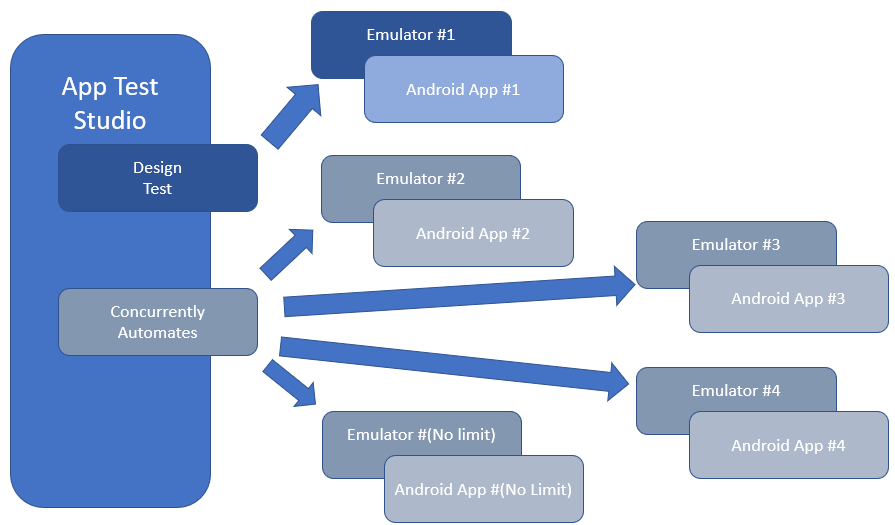
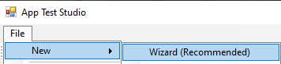
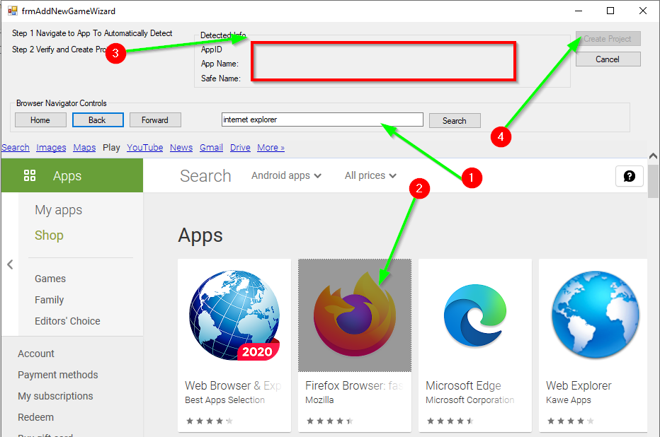
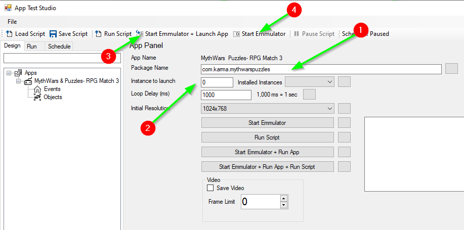

# AppTestStudio

AppTestStudio is a automated development environment, it contains a builder, tester, and can simultaneously run multiple scripts that can automate multiple android apps.  

Interactively: Design, Test, Schedule and Play multiple clients at the same time.

## Getting Started
1. Install [NoxPlayer](https://www.bignox.com/)

1.1 - Launch NoxPlayer client go to Gear on the top menu(Settings)->Interface Settings-> Make sure fixed Window size is checked.

2. Install the app of your choice on the Nox player.

3. Install AppTestStudio

## To Create a new project in AppTestStudio use the Wizard.

### 1.) In AppTestStudio go to File->New->Wizard

### 2.) Use the wizard to quickly configure a project in seconds.
1.) Search for app/game

2.) Click the game.
w
3.) Game ID and Name will autopopulate.

4.) Click Create Project

### 3.) Start the emmulator

***Always launch the Emmulator from AppTestStudio***

1.) The Package Name is used to launch the application when the emmulator starts.  If the Package Name is configured, pressing the "Start Emmulator + Launch App"(3) will launch the instance of nox player specified in the instance to launch(2).  Package Name is recommended but not required, if you don't want or have the Package Name, Press the "Start Emmulator"(4) button instead.  Then run the application from the emmulator manually.  When scheduling a script to run at a later time, the application the Package name is required so that the script can be run, and the applicaion can be loaded.

2.) Instance to launch is the instance number you want to target during testing, launching and running scripts.  This is required, usres with a single instance will always choose instance 0.  Multiple apps/accounts can be configured on different instances.  For example, you could run 5 instances with the same account, and automate 5 different apps/games on each instance.  Or you could run a differnet account on each instance, and run 5 separate instances of the same app/game.

3.)  The Start Emmulator + Launch App button will run the Android Emmulator and 

On the Events Node in AppTestStudio Tree, right Click and Choose "Add Event", this will take a screenshot.

Now click on the colors that are unique to this screen, that won't be on other screens.  Add points(number of pixels to consider OK) if the colors vary such as an animation.

Now that the Event is created, Rigth Click and add either more events or add an Action, Now draw a box where you want AppTestStudio to click randomly.

You can click the test Button to test clicks or Test.

When you have a list of events, click Run Script, this will launch a background thread and run the script.  

-=-=-=-=--=-=-=-=--=-=-=-=--=-=-=-=--=-=-=-=--=-=-=-=--=-=-=-=--=-=-=-=--=-=-=-=--=-=-=-=--=-=-=-=--=-=-=-=-

Conversion to C# is almost over, there could be some leftovers here or there typically the implicity to explict casting conversion.

With Minutes of training could save you hours or days.

[AppTestStudio Projects](https://github.com/DanielHarrod/AppTestStudio-Projects/)
